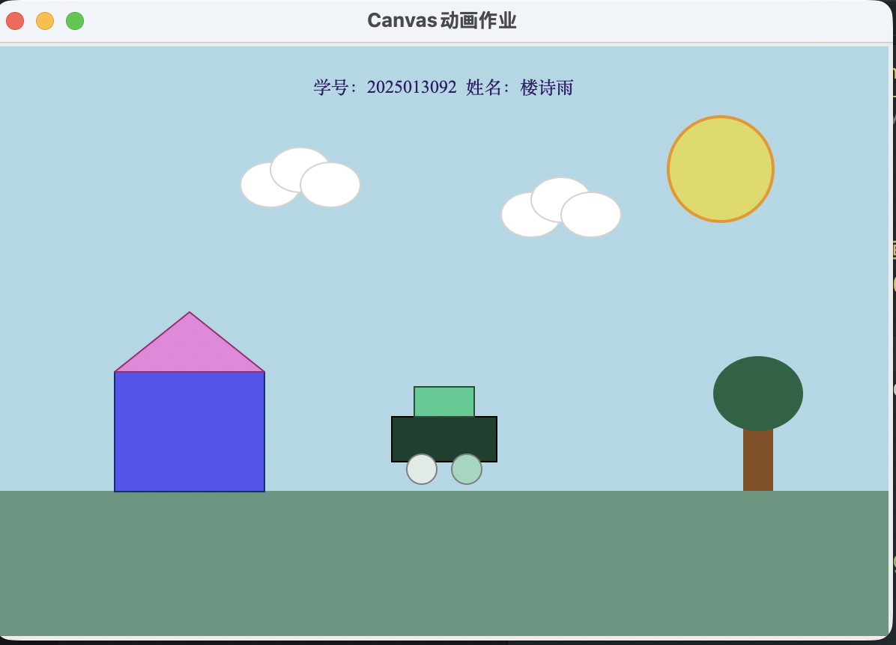

1.画布与背景绘制：创建600*400的Canvas，绘制静态背景元素包含地面、太阳、房子、树、学号和姓名。
2.主体绘制：移动的主体汽车由多个图形组合⽽成（⻋⾝+车顶+左右轮⼦）。
3.动画实现：物体能够平滑移动，且动画流畅。
4.附加功能：
（1）往返运动：汽车移动到边缘后，能够⾃动反向移动
（2）多物体动画：添加2个云朵慢慢飘动，向右飘出后从左边继续进
（3）⿏标交互：绑定⿏标点击事件，点击画布时汽车瞬移到⿏标位置